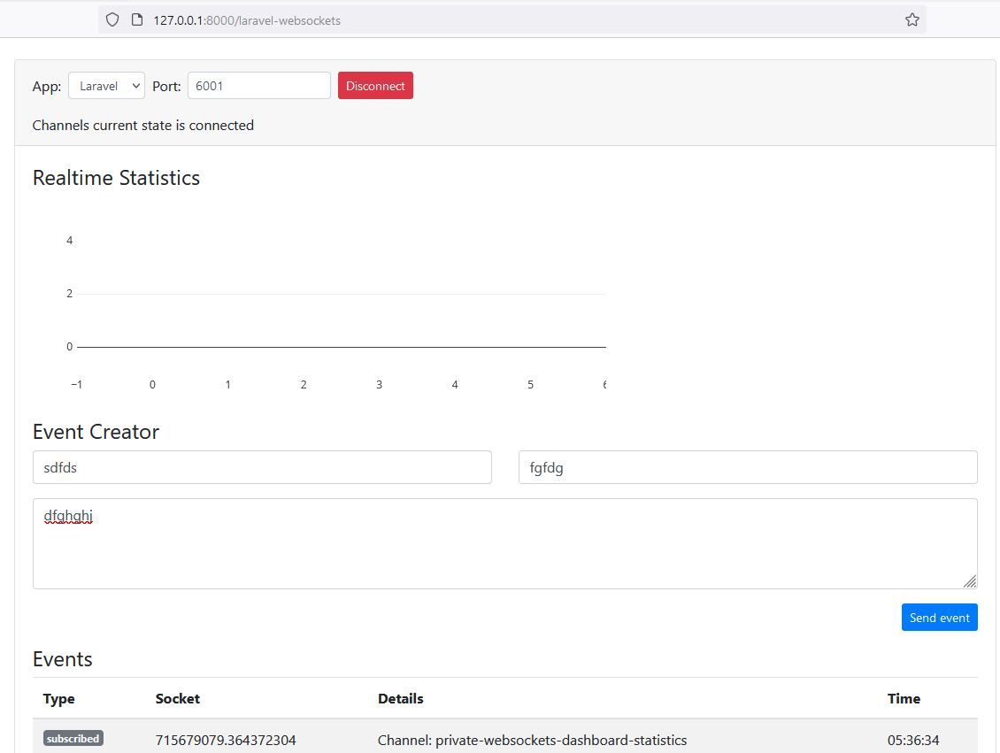

##### How to install, configuration and use this WebSocket package with Laravel broadcast example 

𝐋𝐚𝐫𝐚𝐯𝐞𝐥 𝐖𝐞𝐛𝐒𝐨𝐜𝐤𝐞𝐭𝐬 𝐃𝐨𝐜𝐮𝐦𝐞𝐧𝐭𝐚𝐭𝐢𝐨𝐧:  
https://beyondco.de/docs/laravel-websockets/getting-started/introduction

BeyondCode ( https://beyondco.de/ ) package don’t work with laravel 8

#### Deploy Laravel project from GitHub

<strong><i>Prerequisites:</i></strong> It assumes you have PHP, MySQL, Composer, Node.js, 
Npm installed on your system. 

1. Clone the repo and cd into it

2.  composer install

3. mysql -u root -p 
create database <strong>db_name;</strong> 
exit

4. Edit  <strong>env.</strong> file

5. php artisan migrate

6. Update your Laravel application .env file like this -

   PUSHER_APP_ID=anyId  
   PUSHER_APP_KEY=anyKey  
   PUSHER_APP_SECRET=anySecret  
   PUSHER_APP_CLUSTER=mt1  
   BROADCAST_DRIVER=pusher  

7. npm install  && npm run dev

#### Run

1. php artisan websocket:serve 
2. php artisan serve
3. Visit http://127.0.0.1:8000/laravel-websockets in your browser
4. click connect

